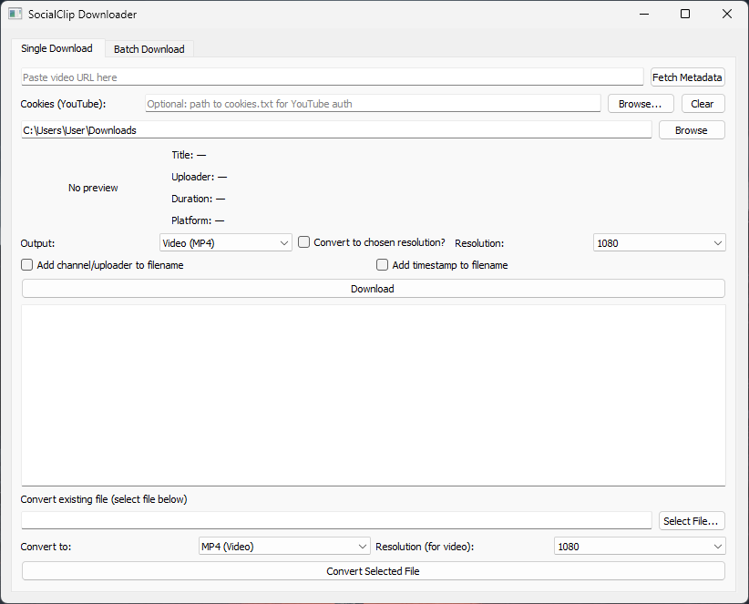

# SocialClip Downloader

[](https://www.python.org/downloads/)
[](https://github.com/yt-dlp/yt-dlp)
[](https://pypi.org/project/PyQt5/)
[](LICENSE)

Desktop application for downloading videos and audio from YouTube, Douyin, Instagram, Twitter/X, TikTok, Bilibili, Facebook, and other yt-dlp-supported sites. Built with PyQt5 and yt-dlp. All processing is local.



## Features

- **Single download** — paste a URL and metadata is fetched automatically; preview thumbnail, download as MP4 or MP3, then **Open folder** to reveal the saved file
- **Batch download** — paste multiple URLs (type them, or **Paste** from the clipboard), then watch a per-URL table of statuses as each file downloads
- **File converter** — convert MP4 to MP3/WAV, downscale resolution
- **Doctor** — first-run welcome and a **Doctor** report (ffmpeg, cookies, network reachability) from the Help menu
- **Resolution targeting** — 720p, 1080p, 1440p, 2160p
- **Auto cookie detection** — per-platform cookie files (`douyin_cookies.txt`, `youtube_cookies.txt`, etc.) are picked up automatically
- **Platform-aware error messages** — shows the correct site name in blocked/cookie errors
- **Filename options** — append channel name and/or timestamp

## Supported Sites

YouTube, Douyin, Instagram, Twitter/X, TikTok, Bilibili, Facebook, and anything yt-dlp supports.

## Installation

### Option A: Download a release binary (no Python needed)

Grab the build for your OS from the
[releases page](https://github.com/petra-dot/socialclip-downloader/releases):

- Windows: `socialclip-downloader-windows.exe`
- macOS: `socialclip-downloader-macos`
- Linux: `socialclip-downloader-linux`

ffmpeg is bundled, so no separate install is needed.

**macOS (unsigned binary).** The build is not code-signed or notarized, so
Gatekeeper will block it on first launch ("cannot be opened because the
developer cannot be verified"). Pick one:

- Right-click the file, choose **Open**, then **Open** again; or
- `xattr -dr com.apple.quarantine socialclip-downloader-macos` in Terminal; or
- System Settings → Privacy & Security → **Open Anyway**.

**Linux.** Mark it executable: `chmod +x socialclip-downloader-linux`.

### Option B: Run from source

1. **Python 3.8+**: Download from [python.org](https://www.python.org/downloads/)
2. **FFmpeg**: Required for media processing. Download from [ffmpeg.org](https://ffmpeg.org/download.html) and add to PATH, or set `SOCIALCLIP_FFMPEG` to its path

```bash
pip install -r requirements.txt
```

## Usage

```bash
python socialclip_downloader.py
```

Launchers: `run.bat` (Windows), `run.sh` (macOS/Linux).

## Command-line usage

The same engine is available headless through `cli.py`, and as a console
binary (`socialclip-windows.exe`, `socialclip-macos`, `socialclip-linux`) on
the [releases page](https://github.com/petra-dot/socialclip-downloader/releases).

```bash
socialclip download URL [--format mp4|mp3] [--resolution 1080] [--output DIR] [--cookies FILE]
socialclip convert FILE [--to mp4|mp3|wav] [--resolution 1080]
socialclip doctor
socialclip manifest-schema
```

- `download` — fetch one URL and save it as MP4 or MP3.
- `convert` — convert a local file to MP4/MP3/WAV, optionally downscaling.
- `doctor` — health report: ffmpeg presence/version, cookie files found, and
  network reachability. Exits `0` when ffmpeg is found, `3` otherwise.
- `manifest-schema` — print the JSON Schema for the result manifest.

Add `--json` to `download`, `convert`, or `doctor` for machine-readable output:
exactly one JSON object on stdout, human-readable text on stderr.

The doctor report carries its own `schema_version` (`"1.1"`), independent of the
download result contract (`"1.0"`).

```console
$ socialclip doctor --json
{"schema_version": "1.1", "ffmpeg": {"found": true, "path": "/usr/bin/ffmpeg", "version": "ffmpeg version 6.1 Copyright (c) 2000-2024 the FFmpeg developers"}, "cookies": [{"platform": "YouTube", "found": false, "path": null}], "network": {"ok": true, "detail": "reachable"}}
```

- `ffmpeg` — `{found, path, version}`; `path`/`version` are `null` when absent.
- `cookies` — one entry per supported platform: `{platform, found, path}`.
- `network` — `{ok, detail}`; `ok` is `true`/`false`/`null` and never raises.

From source, use `python cli.py <command>` instead of `socialclip`.

## Cookie Authentication

Some sites block downloads without cookies. For each platform you use:

1. Install the "Get cookies.txt LOCALLY" browser extension.
2. Log in to the site, export cookies, and save as `<platform>_cookies.txt` in the app directory.
3. The app auto-detects cookie files on fetch. You can also set a custom path via the **Browse** button.

Supported names: `youtube_cookies.txt`, `douyin_cookies.txt`, `instagram_cookies.txt`, `twitter_cookies.txt`, `tiktok_cookies.txt`, `bilibili_cookies.txt`, `facebook_cookies.txt`.

## Project Structure

```
socialclip-downloader/
├── assets/
│   └── icon.ico
├── sites/
│   ├── __init__.py
│   ├── cookies.py
│   └── errors.py
├── ui/
│   ├── __init__.py
│   ├── main_window.py
│   ├── single_tab.py
│   ├── batch_tab.py
│   └── convert_tab.py
├── utils/
│   ├── __init__.py
│   ├── file_utils.py
│   ├── ffmpeg.py
│   └── ydl_opts.py
├── workers/
│   ├── __init__.py
│   ├── batch_worker.py
│   ├── convert_worker.py
│   ├── download_worker.py
│   └── pipeline.py
├── tests/
├── socialclip_downloader.py
├── requirements.txt
├── requirements-dev.txt
├── run.bat
├── run.sh
├── build.bat
└── socialclip_downloader.spec
```

## License

MIT. See [LICENSE](LICENSE).
